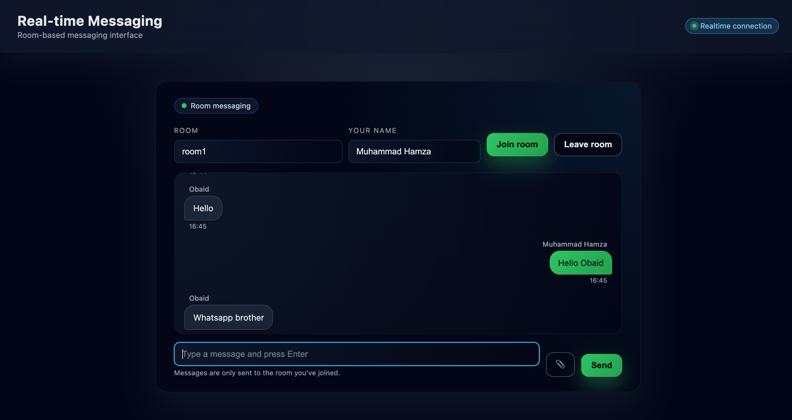

# Real-time Messaging Server

A modular Node.js application with Socket.io integration for real-time, room-based messaging. Built with Express.js and designed with a clean, separation-of-concerns architecture.

## Features

- ✅ **Modular Socket.io Architecture** - Clean separation of socket handlers by functionality
- ✅ **Room-based Messaging** - Join/leave rooms and send messages to specific rooms
- ✅ **Connection Management** - Automatic greeting messages and room validation
- ✅ **Professional Admin Interface** - Built-in EJS template for testing and debugging
- ✅ **Global Configuration** - Centralized Socket.io settings
- ✅ **CORS Support** - Configurable CORS for frontend integration

## Tech Stack

- **Node.js** - Runtime environment
- **Express.js** - Web framework
- **Socket.io** - Real-time bidirectional communication
- **EJS** - Template engine for admin interface
- **dotenv** - Environment variable management

## Installation

1. **Clone the repository** (or navigate to your project directory)

```bash
cd /path/to/node
```

2. **Install dependencies**

```bash
npm install
```

3. **Create environment file** (optional)

Create a `.env` file in the root directory:

```env
PORT=3000
SOCKET_CORS_ORIGIN=http://localhost:5173
```

## Project Structure

```
node/
├── src/
│   ├── config/
│   │   └── socket.js          # Global Socket.io configuration
│   ├── sockets/
│   │   ├── index.js           # Socket.io initialization & connection handling
│   │   └── chat.js            # Chat-specific socket event handlers
│   ├── views/
│   │   └── chat.ejs           # Admin interface for testing
│   └── index.js               # Express server setup & entry point
├── package.json
└── README.md
```

### Architecture Overview

- **`src/index.js`** - Entry point, Express server configuration, and route definitions
- **`src/sockets/index.js`** - Socket.io server initialization and connection lifecycle
- **`src/sockets/chat.js`** - Chat feature handlers (join, leave, message events)
- **`src/config/socket.js`** - Global Socket.io options (CORS, transports, etc.)
- **`src/views/chat.ejs`** - Professional admin interface for testing real-time features

## Running the Project

### Development Mode

```bash
npm run dev
```

Runs the server with `nodemon` for automatic restarts on file changes.

### Production Mode

```bash
npm start
```

Runs the server using Node.js directly.

The server will start on `http://localhost:3000` (or the port specified in your `.env` file).

## Testing

### Using the Admin Interface

1. Start the server: `npm run dev`
2. Open your browser and navigate to: `http://localhost:3000/chat`
3. Fill in the **Room** and **Your name** fields
4. Click **Join room** to connect
5. Send messages and observe real-time updates

### Testing with Multiple Clients

Open multiple browser tabs/windows to the `/chat` page to test multi-user messaging within the same room.

## Socket.io Events API

### Client → Server Events

#### `chat:join`
Join a room to start receiving messages.

```javascript
socket.emit("chat:join", "room1");
```

**Parameters:**
- `roomId` (string) - The room identifier

**Server Response:**
- Emits a `chat:message` event with a welcome message from "System"

---

#### `chat:leave`
Leave a room and stop receiving messages.

```javascript
socket.emit("chat:leave", { roomId: "room1" });
```

**Parameters:**
- `roomId` (string) - The room identifier to leave

**Server Response:**
- Emits a `chat:message` event confirming the user left the room

---

#### `chat:message`
Send a message to a room.

```javascript
socket.emit("chat:message", {
  roomId: "room1",
  message: "Hello, world!",
  user: "John Doe"
});
```

**Parameters:**
- `roomId` (string) - The room to send the message to
- `message` (string) - The message content
- `user` (string) - The sender's display name

**Validation:**
- User must have joined the room using `chat:join` before sending messages
- If not joined, server responds with a warning message

**Server Response:**
- Broadcasts the message to all users in the specified room via `chat:message` event

---

### Server → Client Events

#### `chat:message`
Receive messages from the server (greetings, user messages, system notifications).

```javascript
socket.on("chat:message", (msg) => {
  console.log(msg);
  // {
  //   message: "Hello, world!",
  //   user: "John Doe",
  //   timestamp: 1234567890
  // }
});
```

**Payload:**
- `message` (string) - The message content
- `user` (string) - The sender's name (or "System" for system messages)
- `timestamp` (number) - Unix timestamp in milliseconds

---

## Frontend Integration

### Installation

Install the Socket.io client library in your frontend project:

```bash
npm install socket.io-client
```

### Basic Connection

```javascript
import { io } from "socket.io-client";

const socket = io("http://localhost:3000", {
  transports: ["websocket"]
});

socket.on("connect", () => {
  console.log("Connected:", socket.id);
});
```

### React Example

```jsx
import { useEffect, useState } from "react";
import { io } from "socket.io-client";

const socket = io("http://localhost:3000", { transports: ["websocket"] });

function ChatRoom({ roomId, userName }) {
  const [messages, setMessages] = useState([]);

  useEffect(() => {
    // Join room on mount
    socket.emit("chat:join", roomId);

    // Listen for messages
    socket.on("chat:message", (msg) => {
      setMessages((prev) => [...prev, msg]);
    });

    // Cleanup on unmount
    return () => {
      socket.emit("chat:leave", { roomId });
      socket.off("chat:message");
    };
  }, [roomId]);

  const sendMessage = (text) => {
    socket.emit("chat:message", {
      roomId,
      message: text,
      user: userName
    });
  };

  return (
    <div>
      {messages.map((msg, i) => (
        <div key={i}>
          <strong>{msg.user}:</strong> {msg.message}
        </div>
      ))}
      <button onClick={() => sendMessage("Hello!")}>Send</button>
    </div>
  );
}
```

### Vanilla JavaScript Example

```javascript
const socket = io("http://localhost:3000", { transports: ["websocket"] });

socket.on("connect", () => {
  // Join a room
  socket.emit("chat:join", "room1");
});

// Listen for messages
socket.on("chat:message", (msg) => {
  console.log(`[${msg.user}]: ${msg.message}`);
});

// Send a message
function sendMessage(text) {
  socket.emit("chat:message", {
    roomId: "room1",
    message: text,
    user: "Your Name"
  });
}
```

## Configuration

### Environment Variables

Create a `.env` file in the root directory:

```env
# Server port (default: 3000)
PORT=3000

# CORS origin for Socket.io (default: http://localhost:3000)
# For production, set this to your frontend domain
SOCKET_CORS_ORIGIN=http://localhost:5173
```

### Socket.io Configuration

Global Socket.io settings are managed in `src/config/socket.js`:

```javascript
const socketOptions = {
  cors: {
    origin: process.env.SOCKET_CORS_ORIGIN || "http://localhost:3000",
    methods: ["GET", "POST"],
  },
};
```

Modify this file to adjust CORS, transports, ping intervals, or other Socket.io server options.

## Adding New Socket Features

To add a new feature module (e.g., notifications, presence, etc.):

1. **Create a new handler file** in `src/sockets/`:

```javascript
// src/sockets/notifications.js
function registerNotificationHandlers(io, socket) {
  socket.on("notifications:subscribe", (userId) => {
    socket.join(`user:${userId}`);
  });
}

module.exports = registerNotificationHandlers;
```

2. **Register it in `src/sockets/index.js`**:

```javascript
const registerNotificationHandlers = require("./notifications");

io.on("connection", (socket) => {
  registerChatHandlers(io, socket);
  registerNotificationHandlers(io, socket); // Add here
});
```

This modular approach keeps your code organized and maintainable.

## API Routes

### `GET /`
Health check endpoint.

**Response:**
```
Server is up and running
```

### `GET /chat`
Renders the admin interface for testing Socket.io functionality.

**Response:**
- HTML page with real-time messaging interface

## Development

### Code Style

- Use CommonJS modules (`require`/`module.exports`)
- Follow the existing modular structure
- Keep socket handlers separated by feature
- Use descriptive variable and function names

### Features
- Join Room
- embedded name on the top of the message
- can share the media files as well like images or pdf(s) etc
- typing feature like the whatsapp
- leave room functionality




### Project Conventions

- Socket event names use colon notation: `feature:action` (e.g., `chat:join`)
- Handler functions are prefixed with `register` (e.g., `registerChatHandlers`)
- Configuration files are placed in `src/config/`
- Views/templates are in `src/views/`

## License

ISC

## Author

muhammad-hamza-liaqat

---

**Built with ❤️ using Node.js and Socket.io**

